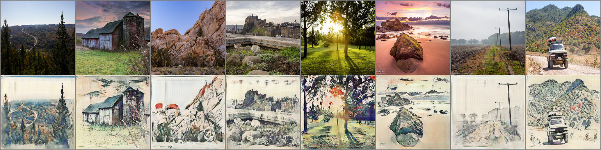

# CycleGAN
Cycle GAN implementation in PyTorch

# Acknowledgments
- https://arxiv.org/abs/1703.10593
- https://github.com/junyanz/pytorch-CycleGAN-and-pix2pix
- https://github.com/aitorzip/PyTorch-CycleGAN
